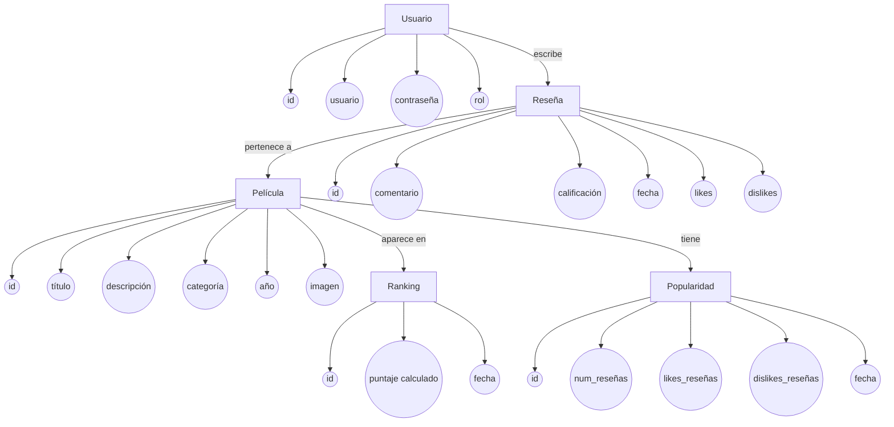
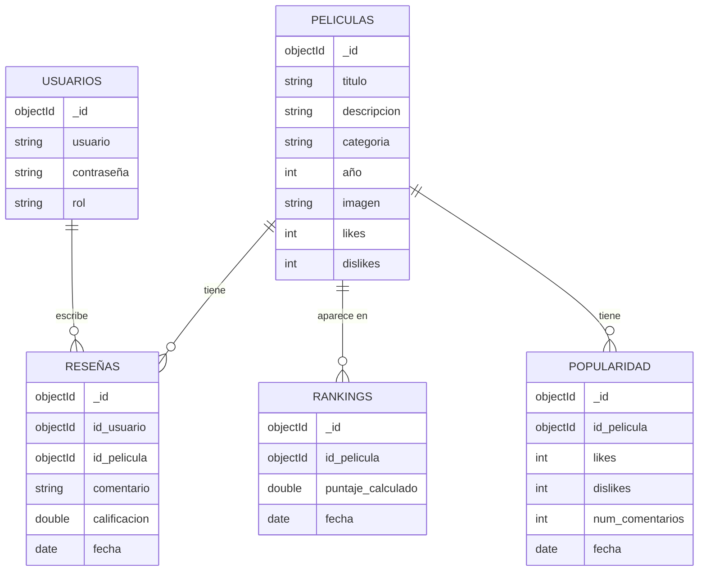
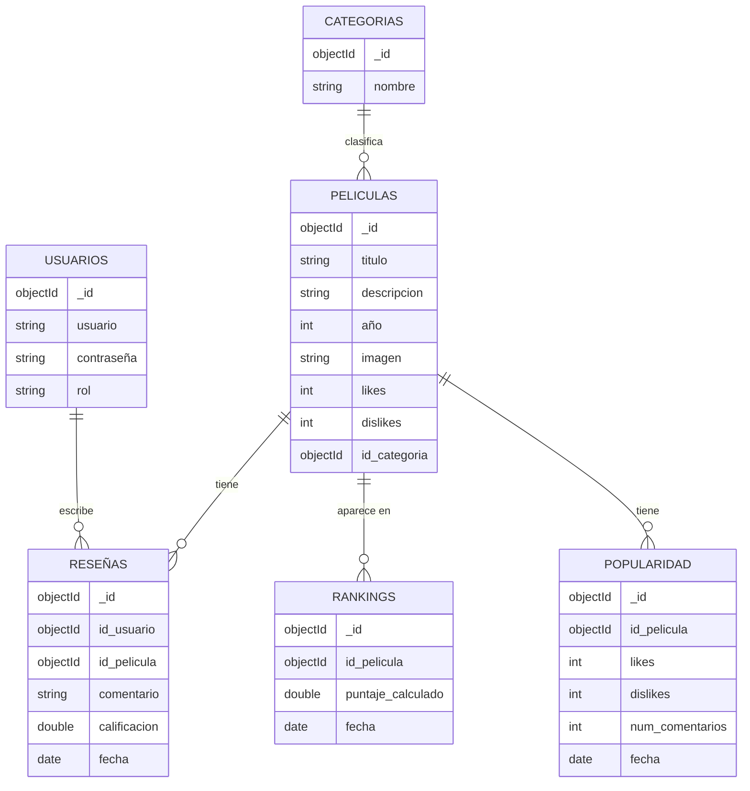
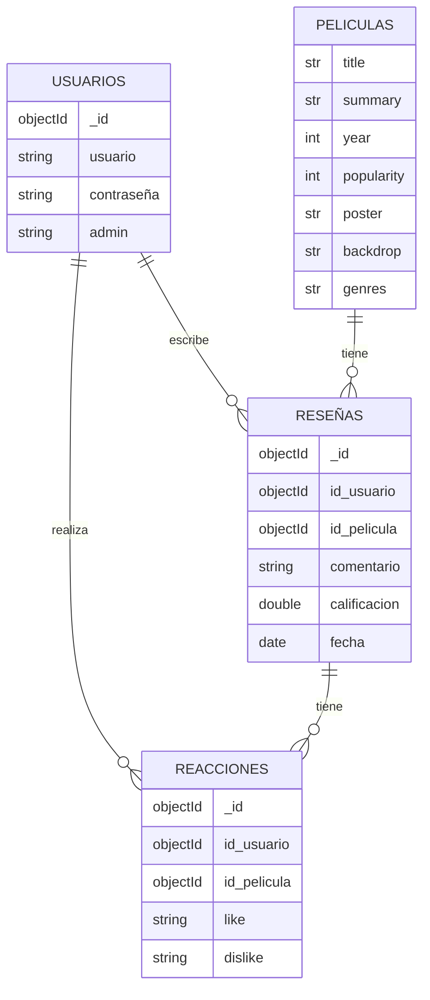

<div align="center">
<h1> RealFilms </h1>
<br>
<br><br>
<br>
<br>
<br>
<br>
<br>
<br>
<br>
<h1>MARIA JULIANA SAAVEDRA MEJIA</h1>
<h1>SARA SOFÍA DÍAZ RODRÍGUEZ</h1>
<h1>S1</h1>
<h1>PEDRO FELIPE GÓMEZ BONILLA</h1>
<br>
<br>
<br>
<br>
<br>
<br>
<br>
<br>
<br>
<h2>CAMPUSLANDS</h2>

<h2>RUTA NODEJS</h2>

<h2>BUCARAMANGA</h2>

<h2>2025</h2>

</div>

<br>
<br>

## Tabla de Contenidos

* [Introducción](#introducción)
* [Caso de Estudio](#caso-de-estudio)
* [Planificación](#planificación)
    * [Construcción del Modelo Conceptual](#construcción-del-modelo-conceptual)
        * [Descripción](#descripción)
        * [Gráfica](#gráfica)
        * [Descripción Técnica](#descripción-técnica)
    * [Construcción del Modelo Lógico](#construcción-del-modelo-lógico)
        * [Descripción](#descripción-1)
        * [Gráfica](#gráfica-1)
        * [Descripción Técnica](#descripción-técnica-1)
    * [Normalización del Modelo Lógico](#normalización-del-modelo-lógico)
        * [Primera Forma Normal (1FN)](#primera-forma-normal-1fn)
            * [Descripción](#descripción-2)
            * [Gráfica](#gráfica-2)
            * [Descripción Técnica](#descripción-técnica-2)
        * [Segunda Forma Normal (2FN)](#segunda-forma-normal-2fn)
            * [Descripción](#descripción-3)
            * [Gráfica](#gráfica-3)
            * [Descripción Técnica](#descripción-técnica-3)
        * [Tercera Forma Normal (3FN)](#tercera-forma-normal-3fn)
            * [Descripción](#descripción-4)
            * [Gráfica](#gráfica-4)
            * [Descripción Técnica](#descripción-técnica-4)
    * [Construcción del Modelo Físico](#construcción-del-modelo-físico)
        * [Descripción](#descripción-5)
        * [Código](#código)
        * [Descripción Técnica](#descripción-técnica-5)
    * [Diagrama E-R](#diagrama-e-r)
        * [Gráfica](#gráfica-5)
        * [Descripción Técnica](#descripción-técnica-6)
    * [Tablas](#tablas)
        * [Gráfica](#gráfica-6)
        * [Descripción Técnica](#descripción-técnica-7)
    * [Relaciones entre Tablas](#relaciones-entre-tablas)
        * [Gráfica](#gráfica-7)
        * [Descripción Técnica](#descripción-técnica-8)
    * [Inserción de Datos](#inserción-de-datos)
        * [Descripción](#descripción-6)
        * [Gráfica](#gráfica-8)
        * [Descripción Técnica](#descripción-técnica-9)
* [Referencias](#referencias)

---
<div align="center">
 <h2>Introducción</h2>
</div>
En este documento se halla la especificación del desarrollo de la base de datos realizada para un sistema de reseñas de películas, el cual busca permitir la gestión eficiente de todas las operaciones relacionadas con la administración de usuarios, películas, reseñas, rankings y popularidad, tomando como fuente externa de información la API pública de OMDb.

Aquí se muestra de forma esquematizada la creación de una base de datos para una gestión de la información, almacenamiento y manipulación de datos eficiente y asequible para el sistema. Para lograr esto, se realizaron los tipos de modelos necesarios para la base de datos: **modelo conceptual**, **lógico** y **físico**.

El **modelo conceptual** es una descripción de los requerimientos a grandes rasgos, identificando las principales entidades, atributos y las relaciones de los datos, para crear una esquematización general que plasme todo correctamente a partir de una idea.

El **modelo lógico** trabaja con lo logrado en el modelo conceptual, con la diferencia de que implementa una estructura más específica de los datos, definiendo colecciones, llaves primarias o foráneas y cardinalidad.

Finalmente, el **modelo físico** para la implementación de una base de datos en MongoDB, que toma en cuenta varios factores del lenguaje de definición de datos y detalles de estos tipos de datos.

El plasmar estos datos tiene como objetivo para esta documentación la **representación visual** que define los sistemas de recopilación y administración de información del sistema de reseñas de películas, logrando ayudar a las diferentes partes interesadas, como analistas e ingenieros, para interpretar de manera efectiva los datos.

## Caso de Estudio
# Caso de Estudio: KarenFlix

##  Objetivo

El objetivo de este proyecto es desarrollar una aplicación **full-stack** usando **Node.js + Express** para el backend y **HTML + CSS puro** para el frontend, que permita a los usuarios registrar, calificar y rankear películas, animes y series geek.  

La aplicación debe incluir funcionalidades para gestionar usuarios, reseñas, categorías y rankings, diferenciando permisos de usuario y administrador.  
Además, debe contar con autenticación segura, validaciones robustas y un frontend que consuma la API desarrollada.

---

## Requerimientos Técnicos

- Backend desarrollado completamente en **Node.js + Express**.
- Autenticación con **JWT** usando `passport-jwt`, `jsonwebtoken` y `bcrypt`.
- Manejo de variables de entorno con **dotenv**.
- Implementación de **express-rate-limit** para limitar peticiones y prevenir abusos.
- Validaciones en endpoints con **express-validator**.
- Persistencia en **MongoDB**, usando el **driver oficial (sin mongoose)**.
- Documentación de endpoints con **swagger-ui-express**.
- Versionado de la API siguiendo **semver**.
- Manejo de transacciones reales en MongoDB para operaciones críticas:
  - Creación de reseñas con rating inicial.
  - Gestión de likes/dislikes en reseñas.
---

## Funcionalidades Requeridas

### 1. Gestión de Usuarios
- Registro, inicio de sesión y autenticación mediante JWT.  
- Roles disponibles:
  - **Usuario**.
  - **Administrador**.  
- Los administradores pueden gestionar categorías y aprobar películas.

---

### 2. Gestión de Películas y Series
- CRUD de películas/series.  
- Solo administradores aprueban nuevas entradas.  
- Validación para evitar títulos repetidos.  
- Atributos mínimos: 
  - título  
  - descripción  
  - categoría  
  - año  
  - imagen (opcional)  

---

### 3. Gestión de Reseñas y Ratings
- Los usuarios pueden crear, editar y eliminar reseñas.  
- Cada reseña incluye:
  - título  
  - comentario  
  - calificación numérica permitiendo decimales: 1.0, 1.1, …, 5.0.  
- Los usuarios pueden dar **like/dislike** a reseñas de otros (no a las propias).  
- El sistema calcula un **ranking ponderado** de películas basado en:
  - calificaciones,  
  - likes/dislikes,  
  - fecha de reseña.  

---

### 4. Categorías
- CRUD de categorías (ejemplo: Anime, Ciencia Ficción, Superhéroes, Fantasía).  
- Mínimo 4 categorías iniciales.  
- Solo administradores pueden gestionarlas.  

---

### 5. Ranking y Listados
- Listado de películas con ordenamiento por:
  - **popularidad**  
  - **ranking**  
- Filtrado por categoría.  
- Vista de detalle con información y reseñas asociadas.  

---


### Construcción del Modelo Conceptual
Este modelo plasma gráficamente de forma general y estructurada la información que gestiona el sistema de **KarenFlix**, sin especificaciones en aspectos técnicos como el uso de llaves primarias o de implementación.

En la creación de este modelo, se analizó el contexto del proyecto, enfocado en el mundo del entretenimiento geek (películas, animes y series), atendiendo a los detalles claves del funcionamiento de la plataforma, las interacciones de los usuarios y demás requerimientos importantes. Este modelo permite una comunicación clara entre las reglas de negocio y el sistema físico de gestión de bases de datos, garantizando una transición efectiva hacia etapas más técnicas del diseño.


#### Descripción

Este modelo se realizó en base a **entidad-relación**, en la que una entidad es un objeto, ya sea un usuario, película, reseña o categoría, que previamente es gestionado en la base de datos. Los **atributos** son las propiedades que describen y se relacionan con estas entidades, como por ejemplo el título de una película o la calificación de una reseña. Las **relaciones** describen los vínculos entre entidades definiendo la interacción que se representa por las cardinalidades, como la relación entre un usuario y sus reseñas, o una película y sus categorías.

#### Gráfica



### Descripción Técnica

El diseño del modelo conceptual cuenta con estos elementos, donde las entidades estan en los rectangulos, los atributos de estas entidades en elipses, las relaciones en rombos con el verbo o accion dentro de este y por ultimo la cardinalidad de las entidades tal y como estan indicadas en la imagen, la cabeza de la flecha indican el 1 en la relación.

<br>

# Construcción del Modelo Lógico
El modelo lógico organiza la información en colecciones de MongoDB, definiendo la estructura de los documentos, sus campos principales y las relaciones entre colecciones. Se construye a partir del modelo conceptual, respetando las entidades, atributos y relaciones previamente identificados.

## Representación Gráfica

<br>

# Relaciones y Cardinalidades 

**Relación**: Un usuario puede registrar varias reacciones (like, visto, pendiente, favorito, etc.), pero cada reacción pertenece únicamente a un usuario.
    
*   **Cardinalidad**:
    
    *   Usuario **(1) → (N)** Reacciones
        
    *   Reacción **(N) → (1)** Usuario
        

2\. Usuarios – Comentarios
--------------------------

*   **Relación**: Un usuario puede realizar múltiples comentarios, pero cada comentario pertenece solo a un usuario.
    
*   **Cardinalidad**:
    
    *   Usuario **(1) → (N)** Comentarios
        
    *   Comentario **(N) → (1)** Usuario
        

3\. Películas – Reacciones
--------------------------

*   **Relación**: Una película puede recibir múltiples reacciones de diferentes usuarios. Cada reacción hace referencia a una sola película.
    
*   **Cardinalidad**:
    
    *   Película **(1) → (N)** Reacciones
        
    *   Reacción **(N) → (1)** Película
        

4\. Películas – Comentarios
---------------------------

*   **Relación**: Una película puede tener múltiples comentarios de diferentes usuarios. Cada comentario está asociado a una única película.
    
*   **Cardinalidad**:
    
    *   Película **(1) → (N)** Comentarios
        
    *   Comentario **(N) → (1)** Película
        

5\. Usuarios – Listas
---------------------

*   **Relación**: Un usuario puede crear varias listas, pero cada lista pertenece únicamente a un usuario.
    
*   **Cardinalidad**:
    
    *   Usuario **(1) → (N)** Listas
        
    *   Lista **(N) → (1)** Usuario
        

6\. Listas – Películas
----------------------

*   **Relación**: Una lista puede contener múltiples películas, y una película puede estar incluida en múltiples listas creadas por distintos usuarios.
    
*   **Cardinalidad**:
    
    *   Lista **(N) ↔ (M)** Películas
        
    *   Película **(M) ↔ (N)** Listas

<br>

# Primera Forma Normal (1FN) 
Una tabla o colección está en 1FN si cumple con los siguientes criterios:

❖ Los valores de cada atributo son atómicos (no multivaluados ni compuestos).

❖ No existen grupos repetidos de datos.

❖ Cada registro es único e identificable por una clave primaria.

## Diagrama primera forma normal



# Segunda Forma Normal (2FN)

Una tabla está en **2FN** si cumple con los siguientes criterios:

❖ Está en 1FN.  
❖ Todos los atributos no clave (no pertenecientes a una clave primaria compuesta) dependen completamente de la clave primaria.  

### Diagrama segunda forma normal


<br>

# Tercera Forma Normal (3FN)
Una tabla o colección está en 3FN si cumple con los siguientes criterios:

❖ Está en 2FN.

❖ No existen dependencias transitivas entre atributos no clave.

❖ Todo atributo no clave depende directamente de la clave primaria.

### Diagrama segunda forma normal


<br>

# Construcción del Modelo Físico

El modelo físico corresponde a la etapa final del diseño de la base de datos y está orientado a su implementación real en MongoDB.

En esta fase, se definen las colecciones, los tipos de datos de cada campo y las relaciones mediante referencias entre documentos.

## Representación Gráfica

### Colección: usuarios

```json
{
  "_id": "ObjectId",
  "usuario": "string",
  "contraseña": "string",
  "admin": "string"
}
```

### Colección: peliculas

```json
{
  "_id": "ObjectId",
  "title": "string",
  "summary": "string",
  "year": "int",
  "popularity": "int",
  "poster": "string",
  "backdrop": "string",
  "genres": "string"
}
```

### Colección: reseñas

```json
{
  "_id": "ObjectId",
  "id_usuario": "ObjectId",
  "id_pelicula": "ObjectId",
  "comentario": "string",
  "calificacion": "double",
  "fecha": "date"
}
```

### Colección: reacciones

```json
{
  "_id": "ObjectId",
  "id_usuario": "ObjectId",
  "id_pelicula": "ObjectId",
  "like": "string",
  "dislike": "string"
}
```
p

#  Tecnologías y Herramientas Utilizadas

### 1. MongoDB

Base de datos NoSQL orientada a documentos, ideal para almacenar y consultar grandes volúmenes de información 

##  4. GitHub

Repositorio **en GitHub** para entrega y control de versiones del proyecto.

###  Estructura organizada por carpetas:

##  5. Herramientas de Modelado

Se utilizaron herramientas de diagramación para representar el modelo lógico y entidad-relación del sistema:

- **Mermaid.js** para diagramas ER en Markdown.


# Contacto

Si tienes preguntas, sugerencias o encuentras algún problema con la implementación, no dudes en contactarme a través de:

- GitHub: [Sarasofia1214](https://github.com/Sarasofia1214) o [Maria Juliana Saavedra Mejia](Maria-Juliana-Saavedra-Mejia)
- Puedes abrir un [Issue aquí](https://github.com/Sarasofia1214/Proyecto_Express_BackEnd_DiazSara_SaavedraMaria/issues)


